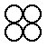

# Quick: 그림과 함께 Racket 시작하기

이 튜토리얼은 그림 그리는 라이브러리를 통해 Racket 프로그래밍 언어에 대한 간단한 맛보기를 진행합니다. 혹여 Racket을 예술적인 목적으로 사용하려는 게 아니더라도 그림 라이브러리는 흥미롭고 깨달음을 주는 예시를 제공합니다. 결국에는 하나의 그림이 오백 번의 `“hello world”` 만큼의 가치를 지닐 것입니다.

우리는 예시를 실행할 때 [DrRacket](https://download.racket-lang.org/)을 사용할 것이라고 가정하고 튜토리얼을 진행할 것입니다. DrRacket을 사용하는 것은 언어의 감을 익히고 시스템의 느낌을 알려줄 가장 빠른 방법입니다. 비록 이후에 Emacs나 vi와 같은 다른 에디터를 사용하게 될지라도 말입니다.

---

## 목차
1. [준비하기](#준비하기)
1. [세팅하기](#세팅하기)
1. [실행하기](#실행하기)
1. [정의 (Definition)](#정의)
1. [로컬 바인딩 (Local Binding)](#로컬-바인딩)
1. [함수와 값 (Functions are Values)](#함수와-값)
1. [미완] [어휘 범위 (Lexical Scope)](#어휘-범위)
1. [미완] [리스트 (Lists)](#리스트)
1. [미완] [모듈 (Modules)](#모듈)
1. [미완] [매크로 (Macros)](#매크로)
1. [미완] [객체 (Objects)](#객체)
1. [미완] [다음 스텝](#다음-스텝)

---

## 준비하기

[Racket을 다운로드](https://download.racket-lang.org/)하고, 설치하고, DrRacket을 실행하십시오.

---

## 세팅하기

> DrRacket IDE의 간략한 개요를 보기 위해서는 [DrRacket 문서](https://docs.racket-lang.org/drracket/interface-essentials.html)를 참고 바랍니다.

그림을 그리기 위해서는, 그림 라이브러리에서 슬라이드 쇼를 만드는 그림 함수를 불러와야 합니다. *정의 영역(definitions area)* 이라는 상단의 텍스트 영역 아래의 코드를 붙여넣어 주십시오:

```
#lang slideshow
```

<pre>
<a href="https://docs.racket-lang.org/guide/Module_Syntax.html#%28part._hash-lang%29">#lang</a> <a href="https://docs.racket-lang.org/slideshow/index.html">slideshow</a>
</pre>

**실행 (Run)** 버튼을 클릭합니다. 당신은 커서가 *상호 영역(interactions area)* 이라는 하단의 텍스트 영역으로 이동한 것을 볼 수 있을 것입니다.

만약 DrRacket을 이전에 사용한 적이 있다면, 실행하기 전에 **Language|Choose Language...** 경로를 통해 DrRacket을 리셋해야 할 수도 있습니다.

---

## 실행하기

상호 영역의 `>` 기호 뒤에 수식(expression)을 입력하고 엔터(Enter) 버튼을 누르면, DrRacket은 수식을 평가하여 결과를 프린트합니다. 수식은 숫자 `5`나 문자열 `"art gallery"`처럼 특정한 값일 수도 있습니다:

```
> 5
5
> "art gallery"
"art gallery"
```

수식은 함수 호출(function call)일 수도 있습니다. 함수를 호출하기 위해서는, 아래와 같이 괄호를 열고 함수 이름과 인수(argument)를 적은 후 괄호를 닫으면 됩니다:

<pre>
> (<a href="https://docs.racket-lang.org/pict/Basic_Pict_Constructors.html#%28def._%28%28lib._pict%2Fmain..rkt%29._circle%29%29">circle</a> 10)

</pre>

[circle](https://docs.racket-lang.org/pict/Basic_Pict_Constructors.html#%28def._%28%28lib._pict%2Fmain..rkt%29._circle%29%29) 함수는 이미지 값을 가지는데, 숫자와 문자열과 비슷한 방식으로 결과를 프린트합니다. [circle](https://docs.racket-lang.org/pict/Basic_Pict_Constructors.html#%28def._%28%28lib._pict%2Fmain..rkt%29._circle%29%29) 함수의 인수는 원의 픽셀 사이즈를 결정합니다. [rectangle](https://docs.racket-lang.org/pict/Basic_Pict_Constructors.html#%28def._%28%28lib._pict%2Fmain..rkt%29._rectangle%29%29) 함수는 `circle`과 달리 두 개의 인수를 필요로 합니다:

<pre>
> (<a href="https://docs.racket-lang.org/pict/Basic_Pict_Constructors.html#%28def._%28%28lib._pict%2Fmain..rkt%29._rectangle%29%29">rectangle</a> 10 20)

</pre>

[circle](https://docs.racket-lang.org/pict/Basic_Pict_Constructors.html#%28def._%28%28lib._pict%2Fmain..rkt%29._circle%29%29) 함수에 잘못된 개수의 인수를 넣어봅시다:

```
> (circle 10 20)
circle: arity mismatch;
 the expected number of arguments does not match the given number
  expected: 1 plus optional arguments with keywords
#:border-color and #:border-width
  given: 2
  arguments...:
   10
   20
```

노트: DrRacket은 에러를 발생시키는 수식을 분홍색으로 표시합니다 (하지만 이 문서에는 분홍색으로 표시되지 않았습니다).

기본적인 그림 생성자(constructor)인 [circle](https://docs.racket-lang.org/pict/Basic_Pict_Constructors.html#%28def._%28%28lib._pict%2Fmain..rkt%29._circle%29%29)과 [rectangle](https://docs.racket-lang.org/pict/Basic_Pict_Constructors.html#%28def._%28%28lib._pict%2Fmain..rkt%29._rectangle%29%29) 외에도, 그림을 결합하는 [hc-append](https://docs.racket-lang.org/pict/Pict_Combiners.html#%28def._%28%28lib._pict%2Fmain..rkt%29._hc-append%29%29) 함수도 존재합니다. Racket에서 함수 호출을 하면 다음과 같습니다:

<pre>
> (<a href="https://docs.racket-lang.org/pict/Pict_Combiners.html#%28def._%28%28lib._pict%2Fmain..rkt%29._hc-append%29%29">hc-append</a> (<a href="https://docs.racket-lang.org/pict/Basic_Pict_Constructors.html#%28def._%28%28lib._pict%2Fmain..rkt%29._circle%29%29">circle</a> 10) (<a href="https://docs.racket-lang.org/pict/Basic_Pict_Constructors.html#%28def._%28%28lib._pict%2Fmain..rkt%29._rectangle%29%29">rectangle</a> 10 20))

</pre>

[hc-append](https://docs.racket-lang.org/pict/Pict_Combiners.html#%28def._%28%28lib._pict%2Fmain..rkt%29._hc-append%29%29)의 하이픈(`-`)은 식별자의 일부일 뿐입니다; `hc` 빼기 `append`가 아닙니다. 함수가 `h`로 시작하는 이유는 이 함수가 그림을 가로(horizontal)로 결합하기 때문이며, 다음 글자가 `c`인 이유는 결합되는 그림들이 세로로 중간에 정렬(centered)되기 때문입니다.

만약 어떤 다른 함수가 존재하는지 -- 이를테면 그림을 세로로 쌓거나 왼쪽 정렬되는 함수들 -- 궁금하다면 DrRacket에서 커서를 [hc-append](https://docs.racket-lang.org/pict/Pict_Combiners.html#%28def._%28%28lib._pict%2Fmain..rkt%29._hc-append%29%29)에 대고 F1키를 누르십시오. 그러면 브라우저 창이 열리고, [hc-append](https://docs.racket-lang.org/pict/Pict_Combiners.html#%28def._%28%28lib._pict%2Fmain..rkt%29._hc-append%29%29) 함수의 문서로 향하는 링크를 줄 것입니다. 주어진 링크를 클릭하면 당신은 다양한 함수를 볼 수 있을 것입니다.

만약 이 문서를 HTML 방식으로 보고 있다면, [hc-append](https://docs.racket-lang.org/pict/Pict_Combiners.html#%28def._%28%28lib._pict%2Fmain..rkt%29._hc-append%29%29)을 클릭하거나 이 튜토리얼에서 사용한 임포트(import)된 식별자를 사용해도 됩니다.

---

## 정의

특정 원이나 직사각형 그림을 여러 번 사용하고 싶을 경우, 이름을 정해주는 방법이 더 간단합니다. 정의 영역으로 되돌아가 두 개의 정의문을 추가하면 정의 영역은 다음처럼 보이게 됩니다:

<pre>
<a href="https://docs.racket-lang.org/guide/Module_Syntax.html#%28part._hash-lang%29">#lang</a> <a href="https://docs.racket-lang.org/slideshow/index.html">slideshow</a>
(<a href="https://docs.racket-lang.org/reference/define.html#%28form._%28%28lib._racket%2Fprivate%2Fbase..rkt%29._define%29%29">define</a> c (<a href="https://docs.racket-lang.org/pict/Basic_Pict_Constructors.html#%28def._%28%28lib._pict%2Fmain..rkt%29._circle%29%29">circle</a> 10))
(<a href="https://docs.racket-lang.org/reference/define.html#%28form._%28%28lib._racket%2Fprivate%2Fbase..rkt%29._define%29%29">define</a> r (<a href="https://docs.racket-lang.org/pict/Basic_Pict_Constructors.html#%28def._%28%28lib._pict%2Fmain..rkt%29._rectangle%29%29">rectangle</a> 10 20))
</pre>

그리고 **Run** 버튼을 다시 클릭합니다. 이제, 당신은 `c`나 `r`만 적어도 됩니다:

<pre>
> r

> (<a href="https://docs.racket-lang.org/pict/Pict_Combiners.html#%28def._%28%28lib._pict%2Fmain..rkt%29._hc-append%29%29">hc-append</a> c r)

> (<a href="https://docs.racket-lang.org/pict/Pict_Combiners.html#%28def._%28%28lib._pict%2Fmain..rkt%29._hc-append%29%29">hc-append</a> 20 c r c)

</pre>

보다시피, [hc-append](https://docs.racket-lang.org/pict/Pict_Combiners.html#%28def._%28%28lib._pict%2Fmain..rkt%29._hc-append%29%29) 함수는 그림 인자 앞에 숫자 인자 넣는 것을 허용하고, 그림 인자를 개수 상관없이 허용합니다. 만약 숫자 인자를 적는다면, 그림 사이의 거리가 명시됩니다.

[define](https://docs.racket-lang.org/reference/define.html#%28form._%28%28lib._racket%2Fprivate%2Fbase..rkt%29._define%29%29)의 `c`와 `r`에 대한 평가는 정의 영역 대신 상호 영역에서 이루어질 수도 있습니다. 하지만 정의 영역에서 실질적인 프로그램이 이루어지며 -- 이 영역에서 파일이 저장됩니다 -- 상호 영역은 일시적인 탐구나 디버깅 목적으로 활용됩니다.

프로그램에 정의 함수(function definition)를 추가해봅시다. 정의 함수는 이전의 예시처럼 [define](https://docs.racket-lang.org/reference/define.html#%28form._%28%28lib._racket%2Fprivate%2Fbase..rkt%29._define%29%29)을 사용하는데, 대신 함수 이름 앞에 괄호를 열어주며 함수 인수 뒤에 괄호를 닫아줍니다:

<pre>
(<a href="https://docs.racket-lang.org/reference/define.html#%28form._%28%28lib._racket%2Fprivate%2Fbase..rkt%29._define%29%29">define</a> (square n)
  ; semi-colon starts a line comment.
  ; The expression below is the function body.
  (<a href="https://docs.racket-lang.org/pict/Basic_Pict_Constructors.html#%28def._%28%28lib._pict%2Fmain..rkt%29._filled-rectangle%29%29">filled-rectangle</a> n n))
</pre>

정의의 구문(syntax)은 함수 호출의 구문을 반영합니다:

<pre>
> (square 10)

</pre>

정의가 상호 영역에서 평가될 수 있듯, 수식을 정의 영역에 추가하는 것도 가능합니다. 프로그램이 실행되면 정의 영역에 있는 수식의 결과는 상호 영역에 보여집니다. 지금부터, 우리는 정의와 수식의 예시를 같은 영역에 적을 예정이니 이를 선호하는 영역에 넣어도 됩니다. 그러나 예시들은 서로를 기반으로 하므로 정의는 정의 영역에 넣는 것이 좋습니다.

---

## 로컬 바인딩

[define](https://docs.racket-lang.org/reference/define.html#%28form._%28%28lib._racket%2Fprivate%2Fbase..rkt%29._define%29%29)은 로컬 바인딩을 생성하기 위해 사용할 수 있습니다. 예를 들어, 함수 본체에 사용할 수 있습니다:

<pre>
(<a href="https://docs.racket-lang.org/reference/define.html#%28form._%28%28lib._racket%2Fprivate%2Fbase..rkt%29._define%29%29">define</a> (four p)
  (<a href="https://docs.racket-lang.org/reference/define.html#%28form._%28%28lib._racket%2Fprivate%2Fbase..rkt%29._define%29%29">define</a> two-p (<a href="https://docs.racket-lang.org/pict/Pict_Combiners.html#%28def._%28%28lib._pict%2Fmain..rkt%29._hc-append%29%29">hc-append</a> p p))
  (<a href="https://docs.racket-lang.org/pict/Pict_Combiners.html#%28def._%28%28lib._pict%2Fmain..rkt%29._vc-append%29%29">vc-append</a> two-p two-p))

> (four (circle 10))

</pre>

일반적으로, Racket 개발자들은 로컬 바인딩을 위해 [let](https://docs.racket-lang.org/reference/let.html#%28form._%28%28lib._racket%2Fprivate%2Fletstx-scheme..rkt%29._let%29%29)나 [let*](https://docs.racket-lang.org/reference/let.html#%28form._%28%28lib._racket%2Fprivate%2Fletstx-scheme..rkt%29._let%2A%29%29)을 사용합니다. 이의 장점은 수식의 어느 위치에나 사용할 수 있다는 점입니다. 또한, 많은 식별자에 각각 [define](https://docs.racket-lang.org/reference/define.html#%28form._%28%28lib._racket%2Fprivate%2Fbase..rkt%29._define%29%29)을 필요로 하는 대신 식별자를 한 번에 묶어줍니다:

<pre>
(<a href="https://docs.racket-lang.org/reference/define.html#%28form._%28%28lib._racket%2Fprivate%2Fbase..rkt%29._define%29%29">define</a> (checker p1 p2)
  (<a href="https://docs.racket-lang.org/reference/let.html#%28form._%28%28lib._racket%2Fprivate%2Fletstx-scheme..rkt%29._let%29%29">let</a> ([p12 (<a href="https://docs.racket-lang.org/pict/Pict_Combiners.html#%28def._%28%28lib._pict%2Fmain..rkt%29._hc-append%29%29">hc-append</a> p1 p2)]
        [p21 (<a href="https://docs.racket-lang.org/pict/Pict_Combiners.html#%28def._%28%28lib._pict%2Fmain..rkt%29._hc-append%29%29">hc-append</a> p2 p1)])
    (<a href="https://docs.racket-lang.org/pict/Pict_Combiners.html#%28def._%28%28lib._pict%2Fmain..rkt%29._vc-append%29%29">vc-append</a> p12 p21)))

> (checker (<a href="https://docs.racket-lang.org/pict/Pict_Drawing_Adjusters.html#%28def._%28%28lib._pict%2Fmain..rkt%29._colorize%29%29">colorize</a> (square 10) "red")
           (<a href="https://docs.racket-lang.org/pict/Pict_Drawing_Adjusters.html#%28def._%28%28lib._pict%2Fmain..rkt%29._colorize%29%29">colorize</a> (square 10) "black"))

</pre>

[let](https://docs.racket-lang.org/reference/let.html#%28form._%28%28lib._racket%2Fprivate%2Fletstx-scheme..rkt%29._let%29%29)은 많은 식별자를 동시에 묶어주므로, 바인딩(bindings)들은 서로 언급이 불가합니다. 반면, [let*](https://docs.racket-lang.org/reference/let.html#%28form._%28%28lib._racket%2Fprivate%2Fletstx-scheme..rkt%29._let%2A%29%29)은 이전에 생성된 바인딩을 사용할 수 있습니다:

<pre>
(<a href="https://docs.racket-lang.org/reference/define.html#%28form._%28%28lib._racket%2Fprivate%2Fbase..rkt%29._define%29%29">define</a> (checkerboard p)
  (<a href="https://docs.racket-lang.org/reference/let.html#%28form._%28%28lib._racket%2Fprivate%2Fletstx-scheme..rkt%29._let%2A%29%29">let*</a> ([rp (<a href="https://docs.racket-lang.org/pict/Pict_Drawing_Adjusters.html#%28def._%28%28lib._pict%2Fmain..rkt%29._colorize%29%29">colorize</a> p "red")]
         [bp (<a href="https://docs.racket-lang.org/pict/Pict_Drawing_Adjusters.html#%28def._%28%28lib._pict%2Fmain..rkt%29._colorize%29%29">colorize</a> p "black")]
         [c (checker rp bp)]
         [c4 (four c)])
    (four c4)))

> (checkerboard (square 10))

</pre>

---

## 함수와 값

[circle](https://docs.racket-lang.org/pict/Basic_Pict_Constructors.html#%28def._%28%28lib._pict%2Fmain..rkt%29._circle%29%29) 함수를 호출하는 대신 [circle](https://docs.racket-lang.org/pict/Basic_Pict_Constructors.html#%28def._%28%28lib._pict%2Fmain..rkt%29._circle%29%29)을 수식으로써 평가해봅시다:

<pre>
> <a href="https://docs.racket-lang.org/pict/Basic_Pict_Constructors.html#%28def._%28%28lib._pict%2Fmain..rkt%29._circle%29%29">circle</a>
#<procedure:circle>
</pre>

수식자 [circle](https://docs.racket-lang.org/pict/Basic_Pict_Constructors.html#%28def._%28%28lib._pict%2Fmain..rkt%29._circle%29%29)은 함수로 기능하는데(프로시저(procedure)라고도 알려져 있습니다), 이는 `c`가 `circle`로 기능하는 것과 같습니다. 원 그림과는 달리 함수를 온전히 프린트하기는 쉽지 않은 일이라, DrRacket은 그냥 `#<procedure:circle>`를 프린트합니다.

이 예시는 숫자와 그림처럼 함수도 값이라는 것을 보여줍니다 (비록 프린트는 잘 안 되지만요). 함수가 값이기 때문에, 함수를 다른 함수의 인수로 정의하는 것도 가능합니다:

<pre>
(<a href="https://docs.racket-lang.org/reference/define.html#%28form._%28%28lib._racket%2Fprivate%2Fbase..rkt%29._define%29%29">define</a> (series mk)
  (<a href="https://docs.racket-lang.org/pict/Pict_Combiners.html#%28def._%28%28lib._pict%2Fmain..rkt%29._hc-append%29%29">hc-append</a> 4 (mk 5) (mk 10) (mk 20)))

> (series <a href="https://docs.racket-lang.org/pict/Basic_Pict_Constructors.html#%28def._%28%28lib._pict%2Fmain..rkt%29._circle%29%29">circle</a>)

> (series square)

</pre>

함수를 받아들이는 함수를 호출할 때, 가끔 인수로 사용된 함수가 다른 곳에서는 필요 없는 경우가 있습니다. 함수를 매번 [define](https://docs.racket-lang.org/reference/define.html#%28form._%28%28lib._racket%2Fprivate%2Fbase..rkt%29._define%29%29)으로 정의하는 건 번거로운 일인데, 왜냐하면 이름을 만들어내야 하고 함수의 정의를 넣을 곳을 찾아야 하기 때문입니다. 이를 대체하는 방법으로는, [lambda](https://docs.racket-lang.org/reference/lambda.html#%28form._%28%28lib._racket%2Fprivate%2Fbase..rkt%29._lambda%29%29)으로 익명 함수(anonymous function)를 만들 수 있습니다:

<pre>
> (series (<a href="https://docs.racket-lang.org/reference/lambda.html#%28form._%28%28lib._racket%2Fprivate%2Fbase..rkt%29._lambda%29%29">lambda</a> (size) (checkerboard (square size))))

</pre>

[lambda](https://docs.racket-lang.org/reference/lambda.html#%28form._%28%28lib._racket%2Fprivate%2Fbase..rkt%29._lambda%29%29) 뒤의 괄호 쳐진 이름들은 함수의 인수이며, 수식들은 함수 본체입니다. "함수(function)"와 "프로시저(procedure)" 대신 "lambda"라는 단어를 사용하는 것은 Racket의 역사와 문화의 일부입니다.

함수에서의 [define](https://docs.racket-lang.org/reference/define.html#%28form._%28%28lib._racket%2Fprivate%2Fbase..rkt%29._define%29%29)은 [lambda](https://docs.racket-lang.org/reference/lambda.html#%28form._%28%28lib._racket%2Fprivate%2Fbase..rkt%29._lambda%29%29)를 값으로써 사용하는 간단한 [define](https://docs.racket-lang.org/reference/define.html#%28form._%28%28lib._racket%2Fprivate%2Fbase..rkt%29._define%29%29)의 간단한 버전입니다. 예를 들어, `series`의 정의는 아래와 같이 쓸 수 있습니다:

<pre>
(a href="https://docs.racket-lang.org/reference/define.html#%28form._%28%28lib._racket%2Fprivate%2Fbase..rkt%29._define%29%29">define</a> series
  (<a href="https://docs.racket-lang.org/reference/lambda.html#%28form._%28%28lib._racket%2Fprivate%2Fbase..rkt%29._lambda%29%29">lambda</a> (mk)
    (<a href="https://docs.racket-lang.org/pict/Pict_Combiners.html#%28def._%28%28lib._pict%2Fmain..rkt%29._hc-append%29%29">hc-append</a> 4 (mk 5) (mk 10) (mk 20))))
</pre>

대부분의 Racket 개발자들은 [lambda](https://docs.racket-lang.org/reference/lambda.html#%28form._%28%28lib._racket%2Fprivate%2Fbase..rkt%29._lambda%29%29)로 확장하는 것보다 [define](https://docs.racket-lang.org/reference/define.html#%28form._%28%28lib._racket%2Fprivate%2Fbase..rkt%29._define%29%29)를 사용하는 빠른 함수 형식을 선호합니다.

---

## 어휘 범위

---

## 리스트

---

## 모듈

---

## 매크로

---

## 객체

---

## 다음 스텝
