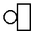
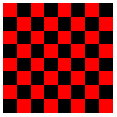
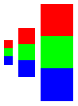

# Quick: 그림과 함께 Racket 시작하기 ([원문](https://docs.racket-lang.org/quick/index.html))

이 튜토리얼은 그림 그리는 라이브러리를 통해 Racket 프로그래밍 언어에 대한 간단한 맛보기를 진행합니다. 혹여 Racket을 예술적인 목적으로 사용하려는 게 아니더라도 그림 라이브러리는 흥미롭고 깨달음을 주는 예시를 제공합니다. 결국에는 하나의 그림이 오백 번의 `“hello world”` 만큼의 가치를 지닐 것입니다.

우리는 예시를 실행할 때 [DrRacket](https://download.racket-lang.org/)을 사용할 것이라고 가정하고 튜토리얼을 진행할 것입니다. DrRacket을 사용하는 것은 언어의 감을 익히고 시스템의 느낌을 알려줄 가장 빠른 방법입니다. 비록 이후에 Emacs나 vi와 같은 다른 에디터를 사용하게 될지라도 말입니다.

---

## 목차
1. [준비하기](#준비하기)
1. [세팅하기](#세팅하기)
1. [실행하기](#실행하기)
1. [정의 (Definition)](#정의)
1. [로컬 바인딩 (Local Binding)](#로컬-바인딩)
1. [함수와 값 (Functions are Values)](#함수와-값)
1. [렉시컬 스코프 (Lexical Scope)](#렉시컬-스코프)
1. [리스트 (Lists)](#리스트)
1. [모듈 (Modules)](#모듈)
1. [매크로 (Macros)](#매크로)
1. [객체 (Objects)](#객체)
1. [다음 스텝](#다음-스텝)

---

## 준비하기

[Racket을 다운로드](https://download.racket-lang.org/)하고, 설치하고, DrRacket을 실행하십시오.

---

## 세팅하기

> DrRacket IDE의 간략한 개요를 보기 위해서는 [DrRacket 문서](https://docs.racket-lang.org/drracket/interface-essentials.html)를 참고 바랍니다.

그림을 그리기 위해서는, 그림 라이브러리에서 슬라이드 쇼를 만드는 그림 함수를 불러와야 합니다. *정의 영역(definitions area)* 이라는 상단의 텍스트 영역 아래의 코드를 붙여넣어 주십시오:

<pre>
<a href="https://docs.racket-lang.org/guide/Module_Syntax.html#%28part._hash-lang%29">#lang</a> <a href="https://docs.racket-lang.org/slideshow/index.html">slideshow</a>
</pre>

**실행 (Run)** 버튼을 클릭합니다. 당신은 커서가 *상호 영역(interactions area)* 이라는 하단의 텍스트 영역으로 이동한 것을 볼 수 있을 것입니다.

만약 DrRacket을 이전에 사용한 적이 있다면, 실행하기 전에 **Language|Choose Language...** 경로를 통해 DrRacket을 리셋해야 할 수도 있습니다.

---

## 실행하기

상호 영역의 `>` 기호 뒤에 수식(expression)을 입력하고 엔터(Enter) 버튼을 누르면, DrRacket은 수식을 평가하여 결과를 프린트합니다. 수식은 숫자 `5`나 문자열 `"art gallery"`처럼 특정한 값일 수도 있습니다:

```
> 5
5
> "art gallery"
"art gallery"
```

수식은 함수 호출(function call)일 수도 있습니다. 함수를 호출하기 위해서는, 아래와 같이 괄호를 열고 함수 이름과 인수(argument)를 적은 후 괄호를 닫으면 됩니다:

<pre>
> (<a href="https://docs.racket-lang.org/pict/Basic_Pict_Constructors.html#%28def._%28%28lib._pict%2Fmain..rkt%29._circle%29%29">circle</a> 10)

</pre>

<code><a href="https://docs.racket-lang.org/pict/Basic_Pict_Constructors.html#%28def._%28%28lib._pict%2Fmain..rkt%29._circle%29%29">circle</a></code> 함수는 이미지 값을 가지는데, 숫자와 문자열과 비슷한 방식으로 결과를 프린트합니다. <code><a href="https://docs.racket-lang.org/pict/Basic_Pict_Constructors.html#%28def._%28%28lib._pict%2Fmain..rkt%29._circle%29%29">circle</a></code> 함수의 인수는 원의 픽셀 사이즈를 결정합니다. <code><a href="https://docs.racket-lang.org/pict/Basic_Pict_Constructors.html#%28def._%28%28lib._pict%2Fmain..rkt%29._rectangle%29%29">rectangle</a></code> 함수는 `circle`과 달리 두 개의 인수를 필요로 합니다:

<pre>
> (<a href="https://docs.racket-lang.org/pict/Basic_Pict_Constructors.html#%28def._%28%28lib._pict%2Fmain..rkt%29._rectangle%29%29">rectangle</a> 10 20)

</pre>

<code><a href="https://docs.racket-lang.org/pict/Basic_Pict_Constructors.html#%28def._%28%28lib._pict%2Fmain..rkt%29._circle%29%29">circle</a></code> 함수에 잘못된 개수의 인수를 넣어봅시다:

```
> (circle 10 20)
circle: arity mismatch;
 the expected number of arguments does not match the given number
  expected: 1 plus optional arguments with keywords
#:border-color and #:border-width
  given: 2
  arguments...:
   10
   20
```

노트: DrRacket은 에러를 발생시키는 수식을 분홍색으로 표시합니다 (하지만 이 문서에는 분홍색으로 표시되지 않았습니다).

기본적인 그림 생성자(constructor)인 <code><a href="https://docs.racket-lang.org/pict/Basic_Pict_Constructors.html#%28def._%28%28lib._pict%2Fmain..rkt%29._circle%29%29">circle</a></code>과 <code><a href="https://docs.racket-lang.org/pict/Basic_Pict_Constructors.html#%28def._%28%28lib._pict%2Fmain..rkt%29._rectangle%29%29">rectangle</a></code> 외에도, 그림을 결합하는 <code><a href="https://docs.racket-lang.org/pict/Pict_Combiners.html#%28def._%28%28lib._pict%2Fmain..rkt%29._hc-append%29%29">hc-append</a></code> 함수도 존재합니다. Racket에서 함수 호출을 하면 다음과 같습니다:

<pre>
> (<a href="https://docs.racket-lang.org/pict/Pict_Combiners.html#%28def._%28%28lib._pict%2Fmain..rkt%29._hc-append%29%29">hc-append</a> (<a href="https://docs.racket-lang.org/pict/Basic_Pict_Constructors.html#%28def._%28%28lib._pict%2Fmain..rkt%29._circle%29%29">circle</a> 10) (<a href="https://docs.racket-lang.org/pict/Basic_Pict_Constructors.html#%28def._%28%28lib._pict%2Fmain..rkt%29._rectangle%29%29">rectangle</a> 10 20))

</pre>

<code><a href="https://docs.racket-lang.org/pict/Pict_Combiners.html#%28def._%28%28lib._pict%2Fmain..rkt%29._hc-append%29%29">hc-append</a></code>의 하이픈(`-`)은 식별자의 일부일 뿐입니다; `hc` 빼기 `append`가 아닙니다. 함수가 `h`로 시작하는 이유는 이 함수가 그림을 가로(horizontal)로 결합하기 때문이며, 다음 글자가 `c`인 이유는 결합되는 그림들이 세로로 중간에 정렬(centered)되기 때문입니다.

만약 어떤 다른 함수가 존재하는지 -- 이를테면 그림을 세로로 쌓거나 왼쪽 정렬되는 함수들 -- 궁금하다면 DrRacket에서 커서를 <code><a href="https://docs.racket-lang.org/pict/Pict_Combiners.html#%28def._%28%28lib._pict%2Fmain..rkt%29._hc-append%29%29">hc-append</a></code>에 대고 F1키를 누르십시오. 그러면 브라우저 창이 열리고, <code><a href="https://docs.racket-lang.org/pict/Pict_Combiners.html#%28def._%28%28lib._pict%2Fmain..rkt%29._hc-append%29%29">hc-append</a></code> 함수의 문서로 향하는 링크를 줄 것입니다. 주어진 링크를 클릭하면 당신은 다양한 함수를 볼 수 있을 것입니다.

만약 이 문서를 HTML 방식으로 보고 있다면, <code><a href="https://docs.racket-lang.org/pict/Pict_Combiners.html#%28def._%28%28lib._pict%2Fmain..rkt%29._hc-append%29%29">hc-append</a></code>를 클릭하거나 이 튜토리얼에서 사용한 임포트(import)된 식별자를 사용해도 됩니다.

---

## 정의

특정 원이나 직사각형 그림을 여러 번 사용하고 싶을 경우, 이름을 정해주는 방법이 더 간단합니다. 정의 영역으로 되돌아가 두 개의 정의문을 추가하면 정의 영역은 다음처럼 보이게 됩니다:

<pre>
<a href="https://docs.racket-lang.org/guide/Module_Syntax.html#%28part._hash-lang%29">#lang</a> <a href="https://docs.racket-lang.org/slideshow/index.html">slideshow</a>
(<a href="https://docs.racket-lang.org/reference/define.html#%28form._%28%28lib._racket%2Fprivate%2Fbase..rkt%29._define%29%29">define</a> c (<a href="https://docs.racket-lang.org/pict/Basic_Pict_Constructors.html#%28def._%28%28lib._pict%2Fmain..rkt%29._circle%29%29">circle</a> 10))
(<a href="https://docs.racket-lang.org/reference/define.html#%28form._%28%28lib._racket%2Fprivate%2Fbase..rkt%29._define%29%29">define</a> r (<a href="https://docs.racket-lang.org/pict/Basic_Pict_Constructors.html#%28def._%28%28lib._pict%2Fmain..rkt%29._rectangle%29%29">rectangle</a> 10 20))
</pre>

그리고 **Run** 버튼을 다시 클릭합니다. 이제, 당신은 `c`나 `r`만 적어도 됩니다:

<pre>
> r

> (<a href="https://docs.racket-lang.org/pict/Pict_Combiners.html#%28def._%28%28lib._pict%2Fmain..rkt%29._hc-append%29%29">hc-append</a> c r)

> (<a href="https://docs.racket-lang.org/pict/Pict_Combiners.html#%28def._%28%28lib._pict%2Fmain..rkt%29._hc-append%29%29">hc-append</a> 20 c r c)

</pre>

보다시피, <code><a href="https://docs.racket-lang.org/pict/Pict_Combiners.html#%28def._%28%28lib._pict%2Fmain..rkt%29._hc-append%29%29">hc-append</a></code> 함수는 그림 인자 앞에 숫자 인자 넣는 것을 허용하고, 그림 인자를 개수 상관없이 허용합니다. 만약 숫자 인자를 적는다면, 그림 사이의 거리가 명시됩니다.

<code><a href="https://docs.racket-lang.org/reference/define.html#%28form._%28%28lib._racket%2Fprivate%2Fbase..rkt%29._define%29%29">define</a></code>의 `c`와 `r`에 대한 평가는 정의 영역 대신 상호 영역에서 이루어질 수도 있습니다. 하지만 정의 영역에서 실질적인 프로그램이 이루어지며 -- 이 영역에서 파일이 저장됩니다 -- 상호 영역은 일시적인 탐구나 디버깅 목적으로 활용됩니다.

프로그램에 정의 함수(function definition)를 추가해봅시다. 정의 함수는 이전의 예시처럼 <code><a href="https://docs.racket-lang.org/reference/define.html#%28form._%28%28lib._racket%2Fprivate%2Fbase..rkt%29._define%29%29">define</a></code>을 사용하는데, 대신 함수 이름 앞에 괄호를 열어주며 함수 인수 뒤에 괄호를 닫아줍니다:

<pre>
(<a href="https://docs.racket-lang.org/reference/define.html#%28form._%28%28lib._racket%2Fprivate%2Fbase..rkt%29._define%29%29">define</a> (square n)
  ; semi-colon starts a line comment.
  ; The expression below is the function body.
  (<a href="https://docs.racket-lang.org/pict/Basic_Pict_Constructors.html#%28def._%28%28lib._pict%2Fmain..rkt%29._filled-rectangle%29%29">filled-rectangle</a> n n))
</pre>

정의의 구문(syntax)은 함수 호출의 구문을 반영합니다:

<pre>
> (square 10)

</pre>

정의가 상호 영역에서 평가될 수 있듯, 수식을 정의 영역에 추가하는 것도 가능합니다. 프로그램이 실행되면 정의 영역에 있는 수식의 결과는 상호 영역에 보여집니다. 지금부터, 우리는 정의와 수식의 예시를 같은 영역에 적을 예정이니 이를 선호하는 영역에 넣어도 됩니다. 그러나 예시들은 서로를 기반으로 하므로 정의는 정의 영역에 넣는 것이 좋습니다.

---

## 로컬 바인딩

<code><a href="https://docs.racket-lang.org/reference/define.html#%28form._%28%28lib._racket%2Fprivate%2Fbase..rkt%29._define%29%29">define</a></code>은 로컬 바인딩을 생성하기 위해 사용할 수 있습니다. 예를 들어, 함수 본체에 사용할 수 있습니다:

<pre>
(<a href="https://docs.racket-lang.org/reference/define.html#%28form._%28%28lib._racket%2Fprivate%2Fbase..rkt%29._define%29%29">define</a> (four p)
  (<a href="https://docs.racket-lang.org/reference/define.html#%28form._%28%28lib._racket%2Fprivate%2Fbase..rkt%29._define%29%29">define</a> two-p (<a href="https://docs.racket-lang.org/pict/Pict_Combiners.html#%28def._%28%28lib._pict%2Fmain..rkt%29._hc-append%29%29">hc-append</a> p p))
  (<a href="https://docs.racket-lang.org/pict/Pict_Combiners.html#%28def._%28%28lib._pict%2Fmain..rkt%29._vc-append%29%29">vc-append</a> two-p two-p))

> (four (circle 10))

</pre>

일반적으로, Racket 개발자들은 로컬 바인딩을 위해 <code><a href="https://docs.racket-lang.org/reference/let.html#%28form._%28%28lib._racket%2Fprivate%2Fletstx-scheme..rkt%29._let%29%29">let</a></code>나 <code><a href="https://docs.racket-lang.org/reference/let.html#%28form._%28%28lib._racket%2Fprivate%2Fletstx-scheme..rkt%29._let%2A%29%29">let*</a></code>을 사용합니다. 이의 장점은 수식의 어느 위치에나 사용할 수 있다는 점입니다. 또한, 많은 식별자에 각각 <code><a href="https://docs.racket-lang.org/reference/define.html#%28form._%28%28lib._racket%2Fprivate%2Fbase..rkt%29._define%29%29">define</a></code>을 필요로 하는 대신 식별자를 한 번에 묶어줍니다:

<pre>
(<a href="https://docs.racket-lang.org/reference/define.html#%28form._%28%28lib._racket%2Fprivate%2Fbase..rkt%29._define%29%29">define</a> (checker p1 p2)
  (<a href="https://docs.racket-lang.org/reference/let.html#%28form._%28%28lib._racket%2Fprivate%2Fletstx-scheme..rkt%29._let%29%29">let</a> ([p12 (<a href="https://docs.racket-lang.org/pict/Pict_Combiners.html#%28def._%28%28lib._pict%2Fmain..rkt%29._hc-append%29%29">hc-append</a> p1 p2)]
        [p21 (<a href="https://docs.racket-lang.org/pict/Pict_Combiners.html#%28def._%28%28lib._pict%2Fmain..rkt%29._hc-append%29%29">hc-append</a> p2 p1)])
    (<a href="https://docs.racket-lang.org/pict/Pict_Combiners.html#%28def._%28%28lib._pict%2Fmain..rkt%29._vc-append%29%29">vc-append</a> p12 p21)))

> (checker (<a href="https://docs.racket-lang.org/pict/Pict_Drawing_Adjusters.html#%28def._%28%28lib._pict%2Fmain..rkt%29._colorize%29%29">colorize</a> (square 10) "red")
           (<a href="https://docs.racket-lang.org/pict/Pict_Drawing_Adjusters.html#%28def._%28%28lib._pict%2Fmain..rkt%29._colorize%29%29">colorize</a> (square 10) "black"))

</pre>

<code><a href="https://docs.racket-lang.org/reference/let.html#%28form._%28%28lib._racket%2Fprivate%2Fletstx-scheme..rkt%29._let%29%29">let</a></code>은 많은 식별자를 동시에 묶어주므로, 바인딩(bindings)들은 서로 언급이 불가합니다. 반면, <code><a href="https://docs.racket-lang.org/reference/let.html#%28form._%28%28lib._racket%2Fprivate%2Fletstx-scheme..rkt%29._let%2A%29%29">let*</a></code>은 이전에 생성된 바인딩을 사용할 수 있습니다:

<pre>
(<a href="https://docs.racket-lang.org/reference/define.html#%28form._%28%28lib._racket%2Fprivate%2Fbase..rkt%29._define%29%29">define</a> (checkerboard p)
  (<a href="https://docs.racket-lang.org/reference/let.html#%28form._%28%28lib._racket%2Fprivate%2Fletstx-scheme..rkt%29._let%2A%29%29">let*</a> ([rp (<a href="https://docs.racket-lang.org/pict/Pict_Drawing_Adjusters.html#%28def._%28%28lib._pict%2Fmain..rkt%29._colorize%29%29">colorize</a> p "red")]
         [bp (<a href="https://docs.racket-lang.org/pict/Pict_Drawing_Adjusters.html#%28def._%28%28lib._pict%2Fmain..rkt%29._colorize%29%29">colorize</a> p "black")]
         [c (checker rp bp)]
         [c4 (four c)])
    (four c4)))

> (checkerboard (square 10))

</pre>

---

## 함수와 값

<code><a href="https://docs.racket-lang.org/pict/Basic_Pict_Constructors.html#%28def._%28%28lib._pict%2Fmain..rkt%29._circle%29%29">circle</a></code> 함수를 호출하는 대신 <code><a href="https://docs.racket-lang.org/pict/Basic_Pict_Constructors.html#%28def._%28%28lib._pict%2Fmain..rkt%29._circle%29%29">circle</a></code>을 수식으로서 평가해봅시다:

<pre>
> <a href="https://docs.racket-lang.org/pict/Basic_Pict_Constructors.html#%28def._%28%28lib._pict%2Fmain..rkt%29._circle%29%29">circle</a>
#&lt;procedure:circle&gt;
</pre>

수식자 <code><a href="https://docs.racket-lang.org/pict/Basic_Pict_Constructors.html#%28def._%28%28lib._pict%2Fmain..rkt%29._circle%29%29">circle</a></code>은 함수로 기능하는데(프로시저(procedure)라고도 알려져 있습니다), 이는 `c`가 `circle`로 기능하는 것과 같습니다. 원 그림과는 달리 함수를 온전히 프린트하기는 쉽지 않은 일이라, DrRacket은 그냥 `#<procedure:circle>`를 프린트합니다.

이 예시는 숫자와 그림처럼 함수도 값이라는 것을 보여줍니다 (비록 프린트는 잘 안 되지만요). 함수가 값이기 때문에, 함수를 다른 함수의 인수로 정의하는 것도 가능합니다:

<pre>
(<a href="https://docs.racket-lang.org/reference/define.html#%28form._%28%28lib._racket%2Fprivate%2Fbase..rkt%29._define%29%29">define</a> (series mk)
  (<a href="https://docs.racket-lang.org/pict/Pict_Combiners.html#%28def._%28%28lib._pict%2Fmain..rkt%29._hc-append%29%29">hc-append</a> 4 (mk 5) (mk 10) (mk 20)))

> (series <a href="https://docs.racket-lang.org/pict/Basic_Pict_Constructors.html#%28def._%28%28lib._pict%2Fmain..rkt%29._circle%29%29">circle</a>)

> (series square)

</pre>

함수를 받아들이는 함수를 호출할 때, 가끔 인수로 사용된 함수가 다른 곳에서는 필요 없는 경우가 있습니다. 함수를 매번 <code><a href="https://docs.racket-lang.org/reference/define.html#%28form._%28%28lib._racket%2Fprivate%2Fbase..rkt%29._define%29%29">define</a></code>으로 정의하는 건 번거로운 일인데, 왜냐하면 이름을 만들어내야 하고 함수의 정의를 넣을 곳을 찾아야 하기 때문입니다. 이를 대체하는 방법으로는, <code><a href="https://docs.racket-lang.org/reference/lambda.html#%28form._%28%28lib._racket%2Fprivate%2Fbase..rkt%29._lambda%29%29">lambda</a></code>으로 익명 함수(anonymous function)를 만들 수 있습니다:

<pre>
> (series (<a href="https://docs.racket-lang.org/reference/lambda.html#%28form._%28%28lib._racket%2Fprivate%2Fbase..rkt%29._lambda%29%29">lambda</a> (size) (checkerboard (square size))))

</pre>

<code><a href="https://docs.racket-lang.org/reference/lambda.html#%28form._%28%28lib._racket%2Fprivate%2Fbase..rkt%29._lambda%29%29">lambda</a></code> 뒤의 괄호 쳐진 이름들은 함수의 인수이며, 수식들은 함수 본체입니다. "함수(function)"와 "프로시저(procedure)" 대신 "lambda"라는 단어를 사용하는 것은 Racket의 역사와 문화의 일부입니다.

함수에서의 <code><a href="https://docs.racket-lang.org/reference/define.html#%28form._%28%28lib._racket%2Fprivate%2Fbase..rkt%29._define%29%29">define</a></code>은 <code><a href="https://docs.racket-lang.org/reference/lambda.html#%28form._%28%28lib._racket%2Fprivate%2Fbase..rkt%29._lambda%29%29">lambda</a></code>를 값으로서 사용하는 간단한 <code><a href="https://docs.racket-lang.org/reference/define.html#%28form._%28%28lib._racket%2Fprivate%2Fbase..rkt%29._define%29%29">define</a></code>의 간단한 버전입니다. 예를 들어, `series`의 정의는 아래와 같이 쓸 수 있습니다:

<pre>
(<a href="https://docs.racket-lang.org/reference/define.html#%28form._%28%28lib._racket%2Fprivate%2Fbase..rkt%29._define%29%29">define</a> series
  (<a href="https://docs.racket-lang.org/reference/lambda.html#%28form._%28%28lib._racket%2Fprivate%2Fbase..rkt%29._lambda%29%29">lambda</a> (mk)
    (<a href="https://docs.racket-lang.org/pict/Pict_Combiners.html#%28def._%28%28lib._pict%2Fmain..rkt%29._hc-append%29%29">hc-append</a> 4 (mk 5) (mk 10) (mk 20))))
</pre>

대부분의 Racket 개발자들은 <code><a href="https://docs.racket-lang.org/reference/lambda.html#%28form._%28%28lib._racket%2Fprivate%2Fbase..rkt%29._lambda%29%29">lambda</a></code>로 확장하는 것보다 <code><a href="https://docs.racket-lang.org/reference/define.html#%28form._%28%28lib._racket%2Fprivate%2Fbase..rkt%29._define%29%29">define</a></code>를 사용하는 빠른 함수 형식을 선호합니다.

---

## 렉시컬 스코프

Racket은 렉시컬 스코프(lexically scoped)인 언어로서, 식별자가 수식으로 사용될 때, 수식의 텍스트 환경이 식별자의 바인딩을 결정한다는 의미입니다. 이 규칙은 <code><a href="https://docs.racket-lang.org/reference/lambda.html#%28form._%28%28lib._racket%2Fprivate%2Fbase..rkt%29._lambda%29%29">lambda</a></code> 본체의 식별자를 포함한 다른 어느 곳에서도 적용됩니다.

아래의 `rgb-series` 함수에서는, 각 <code><a href="https://docs.racket-lang.org/reference/lambda.html#%28form._%28%28lib._racket%2Fprivate%2Fbase..rkt%29._lambda%29%29">lambda</a></code>에서 `mk`를 사용하는 것은 `rgb-series`의 인자를 의미하는데, 왜냐하면 텍스트 적인 범위에 있는 바인딩이기 때문입니다:

<pre>
(<a href="https://docs.racket-lang.org/reference/define.html#%28form._%28%28lib._racket%2Fprivate%2Fbase..rkt%29._define%29%29">define</a> (rgb-series mk)
  (<a href="https://docs.racket-lang.org/pict/Pict_Combiners.html#%28def._%28%28lib._pict%2Fmain..rkt%29._vc-append%29%29">vc-append</a>
    (series (<a href="https://docs.racket-lang.org/reference/lambda.html#%28form._%28%28lib._racket%2Fprivate%2Fbase..rkt%29._lambda%29%29">lambda</a> (sz) (<a href="https://docs.racket-lang.org/pict/Pict_Drawing_Adjusters.html#%28def._%28%28lib._pict%2Fmain..rkt%29._colorize%29%29">colorize</a> (mk sz) "red")))
    (series (<a href="https://docs.racket-lang.org/reference/lambda.html#%28form._%28%28lib._racket%2Fprivate%2Fbase..rkt%29._lambda%29%29">lambda</a> (sz) (<a href="https://docs.racket-lang.org/pict/Pict_Drawing_Adjusters.html#%28def._%28%28lib._pict%2Fmain..rkt%29._colorize%29%29">colorize</a> (mk sz) "green")))
    (series (<a href="https://docs.racket-lang.org/reference/lambda.html#%28form._%28%28lib._racket%2Fprivate%2Fbase..rkt%29._lambda%29%29">lambda</a> (sz) (<a href="https://docs.racket-lang.org/pict/Pict_Drawing_Adjusters.html#%28def._%28%28lib._pict%2Fmain..rkt%29._colorize%29%29">colorize</a> (mk sz) "blue")))))

> (rgb-series circle)

> (rgb-series square)

</pre>

아래의 또 다른 예시에서는 `rgb-maker`가 함수를 가지며, 원래의 함수를 기억하고 사용하는 새 함수를 반환합니다.

<pre>
(<a href="https://docs.racket-lang.org/reference/define.html#%28form._%28%28lib._racket%2Fprivate%2Fbase..rkt%29._define%29%29">define</a> (rgb-maker mk)
  (<a href="https://docs.racket-lang.org/reference/lambda.html#%28form._%28%28lib._racket%2Fprivate%2Fbase..rkt%29._lambda%29%29">lambda</a> (sz)
    (<a href="https://docs.racket-lang.org/pict/Pict_Combiners.html#%28def._%28%28lib._pict%2Fmain..rkt%29._vc-append%29%29">vc-append</a> (<a href="https://docs.racket-lang.org/pict/Pict_Drawing_Adjusters.html#%28def._%28%28lib._pict%2Fmain..rkt%29._colorize%29%29">colorize</a> (mk sz) "red")
               (<a href="https://docs.racket-lang.org/pict/Pict_Drawing_Adjusters.html#%28def._%28%28lib._pict%2Fmain..rkt%29._colorize%29%29">colorize</a> (mk sz) "green")
               (<a href="https://docs.racket-lang.org/pict/Pict_Drawing_Adjusters.html#%28def._%28%28lib._pict%2Fmain..rkt%29._colorize%29%29">colorize</a> (mk sz) "blue"))))

> (series (rgb-maker <a href="https://docs.racket-lang.org/pict/Basic_Pict_Constructors.html#%28def._%28%28lib._pict%2Fmain..rkt%29._circle%29%29">circle</a>))

> (series (rgb-maker square))

</pre>

노트: `rgb-maker`을 사용하여 함수를 결합하는 것이 `rgb-series`를 사용하는 것과 비교하여 그림 내에서 객체의 정렬을 어떻게 다르게 만드는지 주목하십시오.

---

## 리스트

Racket은 Lisp("LISt Processor"의 약자) 언어의 스타일을 많은 부분 상속받았고, 리스트는 Racket의 중요한 부분으로 남아 있습니다.

<code><a href="https://docs.racket-lang.org/reference/pairs.html#%28def._%28%28quote._~23~25kernel%29._list%29%29">list</a></code> 함수는 인수를 숫자 상관없이 받아들이며 지정된 값을 포함하는 리스트를 반환합니다:

<pre>
> (<a href="https://docs.racket-lang.org/reference/pairs.html#%28def._%28%28quote._~23~25kernel%29._list%29%29">list</a> "red" "green" "blue")
'("red" "green" "blue")
> (<a href="https://docs.racket-lang.org/reference/pairs.html#%28def._%28%28quote._~23~25kernel%29._list%29%29">list</a> (<a href="https://docs.racket-lang.org/pict/Basic_Pict_Constructors.html#%28def._%28%28lib._pict%2Fmain..rkt%29._circle%29%29">circle</a> 10) (square 10))
'()'
</pre>

보다시피, 리스트는 홑따옴표(single quote) 뒤에 괄호로 둘러싼 리스트 요소를 프린트합니다. 여기서 혼동이 생길 수 있는데, 왜냐하면 괄호는 <code>(<a href="https://docs.racket-lang.org/pict/Basic_Pict_Constructors.html#%28def._%28%28lib._pict%2Fmain..rkt%29._circle%29%29">circle</a> 10)</code>와 같은 수식과 `'("red" "green" "blue")` 같은 프린트 값 모두에서 사용되기 때문입니다. [다른 곳에서](https://docs.racket-lang.org/guide/Pairs__Lists__and_Racket_Syntax.html#%28part._quoting-lists%29) 논의되었듯이, 따옴표가 가장 큰 차이점입니다. 이 차이점을 강조하기 위해, 문서와 DrRacket에서는 결과로서의 괄호는 파란색으로 프린트합니다.

만약 리스트가 있다면, 당신은 결과적으로 리스트 요소의 각각에 무언가를 하고자 할 것입니다. <code><a href="https://docs.racket-lang.org/reference/pairs.html#%28def._%28%28lib._racket%2Fprivate%2Fmap..rkt%29._map%29%29">map</a></code> 함수는 리스트와 함수를 가져가서 리스트의 각 요소에 함수를 적용시킵니다; 그리고 함수의 결과물을 결합해 새로운 리스트를 반환합니다:

<pre>
(<a href="https://docs.racket-lang.org/reference/define.html#%28form._%28%28lib._racket%2Fprivate%2Fbase..rkt%29._define%29%29">define</a> (rainbow p)
  (<a href="https://docs.racket-lang.org/reference/pairs.html#%28def._%28%28lib._racket%2Fprivate%2Fmap..rkt%29._map%29%29">map</a> (<a href="https://docs.racket-lang.org/reference/lambda.html#%28form._%28%28lib._racket%2Fprivate%2Fbase..rkt%29._lambda%29%29">lambda</a> (color)
          (<a href="https://docs.racket-lang.org/pict/Pict_Drawing_Adjusters.html#%28def._%28%28lib._pict%2Fmain..rkt%29._colorize%29%29">colorize</a> p color))
       (<a href="https://docs.racket-lang.org/reference/pairs.html#%28def._%28%28quote._~23~25kernel%29._list%29%29">list</a> "red" "orange" "yellow" "green" "blue" "purple")))

> (rainbow (square 5))
'()
</pre>

리스트에 활용할 수 있는 또 다른 함수에는 <code><a href="https://docs.racket-lang.org/reference/procedures.html#%28def._%28%28lib._racket%2Fprivate%2Fbase..rkt%29._apply%29%29">apply</a></code>가 있습니다. 이 함수는 <code><a href="https://docs.racket-lang.org/reference/pairs.html#%28def._%28%28lib._racket%2Fprivate%2Fmap..rkt%29._map%29%29">map</a></code>과 비슷하게 함수와 리스트를 필요로 하지만, <code><a href="https://docs.racket-lang.org/reference/procedures.html#%28def._%28%28lib._racket%2Fprivate%2Fbase..rkt%29._apply%29%29">apply</a></code>에게 주어진 함수는 각 인수가 아닌 모든 인수에 한 번에 적용됩니다. <code><a href="https://docs.racket-lang.org/reference/procedures.html#%28def._%28%28lib._racket%2Fprivate%2Fbase..rkt%29._apply%29%29">apply</a></code> 함수는 <code><a href="https://docs.racket-lang.org/pict/Pict_Combiners.html#%28def._%28%28lib._pict%2Fmain..rkt%29._vc-append%29%29">vc-append</a></code>처럼 인수의 개수에 제한이 없는 함수에 유용하게 쓰입니다.

<pre>
> (<a href="https://docs.racket-lang.org/reference/procedures.html#%28def._%28%28lib._racket%2Fprivate%2Fbase..rkt%29._apply%29%29">apply</a> <a href="https://docs.racket-lang.org/pict/Pict_Combiners.html#%28def._%28%28lib._pict%2Fmain..rkt%29._vc-append%29%29">vc-append</a> (rainbow (square 5)))

</pre>

노트: <code>(<a href="https://docs.racket-lang.org/pict/Pict_Combiners.html#%28def._%28%28lib._pict%2Fmain..rkt%29._vc-append%29%29">vc-append</a> (rainbow (square 5)))</code>에서는 <code><a href="https://docs.racket-lang.org/pict/Pict_Combiners.html#%28def._%28%28lib._pict%2Fmain..rkt%29._vc-append%29%29">vc-append</a></code>가 리스트를 인수로 받아들이지 않으므로 실행되지 않을 것입니다; 이 함수는 아무 개수의 그림 인수를 받아들입니다. <code><a href="https://docs.racket-lang.org/reference/procedures.html#%28def._%28%28lib._racket%2Fprivate%2Fbase..rkt%29._apply%29%29">apply</a></code> 함수는 많은 인수를 받아들이거나 모든 인수를 하나의 값으로 사용하고자 하는 함수 사이의 간격을 연결해줍니다.

---

## 모듈

정의 창(definitions window) 안에 있는 프로그램은 아래의 코드처럼 시작되므로

<pre>
<a href="https://docs.racket-lang.org/guide/Module_Syntax.html#%28part._hash-lang%29">#lang</a> <a href="https://docs.racket-lang.org/slideshow/index.html">slideshow</a>
</pre>

정의 창에 입력한 모든 코드는 모듈 안에 있습니다. 게다가, 이 모듈은 시작할 때 <code><a href="https://docs.racket-lang.org/slideshow/index.html">slideshow</a></code>에서 지정된 모든 모듈을 가져오는데, 이 모듈은 그림을 만드는 함수와 <code><a href="https://docs.racket-lang.org/reference/pairs.html#%28def._%28%28quote._~23~25kernel%29._list%29%29">list</a></code>와 <code><a href="https://docs.racket-lang.org/reference/pairs.html#%28def._%28%28lib._racket%2Fprivate%2Fmap..rkt%29._map%29%29">map</a></code>과 같이 자주 쓰이는 함수를 내보냅니다.

추가로 라이브러리를 가져오기 위해서는, <code><a href="https://docs.racket-lang.org/reference/require.html#%28form._%28%28lib._racket%2Fprivate%2Fbase..rkt%29._require%29%29">require</a></code>를 사용합니다. 예를 들어, <code><a href="https://docs.racket-lang.org/pict/More_Pict_Constructors.html#%28mod-path._pict%2Fflash%29">pict/flash</a></code> 라이브러리는 <code><a href="https://docs.racket-lang.org/pict/More_Pict_Constructors.html#%28def._%28%28lib._pict%2Fflash..rkt%29._filled-flash%29%29">filled-flash</a></code> 함수를 제공합니다:

<pre>
(<a href="https://docs.racket-lang.org/reference/require.html#%28form._%28%28lib._racket%2Fprivate%2Fbase..rkt%29._require%29%29">require</a> pict/flash)

> (<a href="https://docs.racket-lang.org/pict/More_Pict_Constructors.html#%28def._%28%28lib._pict%2Fflash..rkt%29._filled-flash%29%29">filled-flash</a> 40 30)

</pre>

모듈은 다양한 방법으로 이름 지어지고 분포됩니다:

<ul>
<li>
일부 모듈은 Racket distribution에 패키징되어있거나 계층 <em>컬렉션</em>에 설치되어있습니다. 예를 들어, <code><a href="https://docs.racket-lang.org/pict/More_Pict_Constructors.html#%28mod-path._pict%2Fflash%29">pict/flash</a></code> 모듈의 이름은 "<code>pict</code> 컬렉션에 위치한 <code>flash.rkt</code> 파일에서 구현된 모듈"이라는 뜻입니다. 모듈 이름에 슬래시(slash)가 없을 때는, 그 모듈은 <code>main.rkt</code> 파일에서 구현되었음을 나타냅니다.
</li>

<li>
일부 모듈 컬렉션은 <em>패키지</em>로 분배됩니다. 패키지를 설치하기 위해서는 DrRacket의 <b>File</b> 메뉴에 있는 <b>Install Package...</b>를 사용하거나, <code>raco pkg</code> 커맨드 라인 툴을 사용할 수 있습니다. 예를 들어, <code>avl</code> 패키지를 설치하면 <code><a href="https://docs.racket-lang.org/avl/index.html">avl</a></code> 모듈을 사용할 수 있습니다.

패키지는 <a href="https://pkgs.racket-lang.org/">https://pkgs.racket-lang.org/</a>에서 등록하거나, 깃 저장소(Git repository), 웹사이트, 파일, 혹은 디렉토리에서 직접적으로 설치할 수 있습니다. 패키지에 대한 자세한 내용은 <a href="https://docs.racket-lang.org/pkg/index.html">Racket 패키지 관리</a>를 참고해주십시오.
</li>

<li>
정의를 저장하기 위해서는, DrRacket의 <a href="https://docs.racket-lang.org/drracket/Menus.html#%28part._menu~3afile%29">Save Definitions</a> 메뉴를 이용합니다.

일부 모듈은 특정한 컬렉션이나 패키지에 속하는 대신 다른 모듈에 관하여 살기도 합니다. 예를 들어, DrRacket에서는, 지금까지 정리한 정의를 <code>quick.rkt</code> 파일에 저장한 후 아래의 라인을 추가하면

<pre>
(<a href="https://docs.racket-lang.org/reference/require.html#%28form._%28%28lib._racket%2Fprivate%2Fbase..rkt%29._provide%29%29">provide</a> rainbow square)
</pre>

DrRacket에서 새 탭이나 창을 열어 <code>quick.rkt</code>와 같은 디렉토리에 <code>use.rkt</code>라는 새로운 프로그램을 작성할 수 있습니다:

<pre>
<a href="https://docs.racket-lang.org/guide/Module_Syntax.html#%28part._hash-lang%29">#lang</a> <a href="https://docs.racket-lang.org/reference/index.html">racket</a>
(<a href="https://docs.racket-lang.org/reference/require.html#%28form._%28%28lib._racket%2Fprivate%2Fbase..rkt%29._require%29%29">require</a> "quick.rkt")
(rainbow (square 5))
</pre>

그리고 <code>use.rkt</code>를 실행하면 무지개 색의 정사각형 리스트가 반환됩니다. 여기서 주목할 점은 <code>use.rkt</code>는 <a href="https://docs.racket-lang.org/reference/index.html">racket</a>을 가져온다는 점인데, 이는 그림 만드는 함수를 제공하지 않지만 <code><a href="https://docs.racket-lang.org/reference/require.html#%28form._%28%28lib._racket%2Fprivate%2Fbase..rkt%29._require%29%29">require</a></code> 함수와 함수 호출 구문을 제공합니다.
</li>
</ul>

Racket 개발자들은 일반적으로 새로운 프로그램과 라이브러리를 상대 경로와 수집 기반 경로를 통해 서로를 가져오는 모듈로서 작성합니다. 프로그램이나 라이브러리가 이러한 방식으로 개발되는 것이 유용해 보일 때, 이는 패키지로 등록될 수 있는데, 특히 구현이 깃 저장소에서 호스팅 되는 경우에 그렇습니다.

> 예시에 쓰인 파일: [quick.rkt](racket/quick.rkt), [use.rkt](racket/use.rkt)

---

## 매크로

여기 시도해볼만한 다른 라이브러리가 있습니다:

<pre>
(<a href="https://docs.racket-lang.org/reference/require.html#%28form._%28%28lib._racket%2Fprivate%2Fbase..rkt%29._require%29%29">require</a> slideshow/code)

> (<a href="https://docs.racket-lang.org/pict/More_Pict_Constructors.html#%28form._%28%28lib._pict%2Fcode..rkt%29._code%29%29">code</a> (<a href="https://docs.racket-lang.org/pict/Basic_Pict_Constructors.html#%28def._%28%28lib._pict%2Fmain..rkt%29._circle%29%29">circle</a> 10))

</pre>

원을 대신해서, 결과물은 수식으로 사용되었다면 원을 만들어내었을 코드 그림입니다. 바꾸어 말하면, <code><a href="https://docs.racket-lang.org/pict/More_Pict_Constructors.html#%28form._%28%28lib._pict%2Fcode..rkt%29._code%29%29">code</a></code>는 함수가 아니라 그림을 만들어내는 구문 형식입니다; 괄호와 <code><a href="https://docs.racket-lang.org/pict/More_Pict_Constructors.html#%28form._%28%28lib._pict%2Fcode..rkt%29._code%29%29">code</a></code> 사이에 있는 것은 수식이 아니라 <code><a href="https://docs.racket-lang.org/pict/More_Pict_Constructors.html#%28form._%28%28lib._pict%2Fcode..rkt%29._code%29%29">code</a></code> 구문 형식에 조작된 부분입니다.

이는 지난 섹션에서 [racket](https://docs.racket-lang.org/reference/index.html)이 <code><a href="https://docs.racket-lang.org/reference/require.html#%28form._%28%28lib._racket%2Fprivate%2Fbase..rkt%29._require%29%29">require</a></code>과 함수 호출 구문을 제공한다고 말했던 설명을 뒷받침해줍니다. 라이브러리는 함수처럼 값을 내보내는 데에 제한되지 않습니다; 라이브러리는 새로운 구문 형식을 정의할 수 있습니다. 이런 의미에서, Racket은 완전한 언어라고 할 수 없습니다; 언어를 확장하거나 완전히 새로운 언어를 만들어낼 수 있도록 언어를 구성하는 아이디어에 더 가깝습니다.

새로운 구문 형식을 소개하는 한 가지 방법으로는 <code><a href="https://docs.racket-lang.org/reference/define.html#%28form._%28%28lib._racket%2Fprivate%2Fbase..rkt%29._define-syntax%29%29">define-syntax</a></code>와 <code><a href="https://docs.racket-lang.org/reference/stx-patterns.html#%28form._%28%28lib._racket%2Fprivate%2Fstxcase-scheme..rkt%29._syntax-rules%29%29">syntax-rules</a></code>를 함께 사용하는 게 있습니다:

<pre>
(<a href="https://docs.racket-lang.org/reference/define.html#%28form._%28%28lib._racket%2Fprivate%2Fbase..rkt%29._define-syntax%29%29">define-syntax</a> pict+code
  (<a href="https://docs.racket-lang.org/reference/stx-patterns.html#%28form._%28%28lib._racket%2Fprivate%2Fstxcase-scheme..rkt%29._syntax-rules%29%29">syntax-rules</a> ()
    [(pict+code expr)
     (<a href="https://docs.racket-lang.org/pict/Pict_Combiners.html#%28def._%28%28lib._pict%2Fmain..rkt%29._hc-append%29%29">hc-append</a> 10
                expr
                (<a href="https://docs.racket-lang.org/pict/More_Pict_Constructors.html#%28form._%28%28lib._pict%2Fcode..rkt%29._code%29%29">code</a> expr))]))

> (pict+code (<a href="https://docs.racket-lang.org/pict/Basic_Pict_Constructors.html#%28def._%28%28lib._pict%2Fmain..rkt%29._circle%29%29">circle</a> 10))

</pre>

이러한 정의를 매크로(macro)라고 합니다. `(pict+code expr)`는 매크로를 사용하는 패턴입니다; 프로그램 속 패턴의 인스턴스(instances)는 해당하는 템플릿의 인스턴스인 `(hc-append 10 expr (code expr))`로 대체됩니다. 특히, `(pict+code (circle 10))`는 `expr`로서의 `(circle 10)`과 패턴이 맞으므로, `(hc-append 10 (circle 10) (code (circle 10)))`으로 대체됩니다.

물론, 이러한 구문 확대에는 장단점이 있습니다: 새로운 언어를 만들어내면 원하는 것을 말하기 쉬워지지만, 다른 사람들이 이해하기 어려워집니다. 실제로 Racket 개발자들은 강연이나 논문에 Racket 코드를 꾸준히 포함하므로 이러한 것들을 연구하는 사람들은 <code><a href="https://docs.racket-lang.org/pict/More_Pict_Constructors.html#%28form._%28%28lib._pict%2Fcode..rkt%29._code%29%29">code</a></code>에 대해 알 가치가 있습니다.

사실, 당신은 이 [문서의 소스(source)](https://docs.racket-lang.org/quick/quick.scrbl)을 보고 싶을 수도 있습니다. 이 문서는 `#lang`로 시작하지만 Racket처럼 보이지 않을 것입니다; 그렇지만, 우리는 문서를 만들 때 Racket 프로그램으로 소스를 실행해가면서 작성했습니다. 우리는 Racket의 구문을 문서로 충분히 작성할 수 있을 정도로 확장하기 위해 <code><a href="https://docs.racket-lang.org/reference/stx-patterns.html#%28form._%28%28lib._racket%2Fprivate%2Fstxcase-scheme..rkt%29._syntax-rules%29%29">syntax-rules</a></code>보다 많은 것을 사용해야 하지만, Racket의 구문 확장을 사용하는 것이 더 어려울 수도 있습니다.

---

## 객체

객체(Object) 시스템은 Racket 사용자가 배우고 사용하는데 가치가 있는 정교한 언어 확장의 또다른 예시입니다. 객체는 <code><a href="https://docs.racket-lang.org/reference/lambda.html#%28form._%28%28lib._racket%2Fprivate%2Fbase..rkt%29._lambda%29%29">lambda</a></code>가 있는 경우에도 함수보다 나을 때가 있으며, 객체는 GUI에서 특히 잘 작동합니다. Racket의 GUI와 그래픽 시스템을 위한 API는 객체와 클래스(classes)로 표현됩니다.

클래스 시스템은 <code><a href="https://docs.racket-lang.org/reference/mzlib_class.html">racket/class</a></code> 라이브러리에 의해 구현되며 <code><a href="https://docs.racket-lang.org/gui/index.html">racket/gui/base</a></code>, 라이브러리는 GUI와 그림 그리는 클래스를 제공합니다. 관례상, 클래스는 `%`로 끝나는 이름을 가집니다:

<pre>
(<a href="https://docs.racket-lang.org/reference/require.html#%28form._%28%28lib._racket%2Fprivate%2Fbase..rkt%29._require%29%29">require</a> racket/class
         racket/gui/base)
(<a href="https://docs.racket-lang.org/reference/define.html#%28form._%28%28lib._racket%2Fprivate%2Fbase..rkt%29._define%29%29">define</a> f (<a href="https://docs.racket-lang.org/reference/objcreation.html#%28form._%28%28lib._racket%2Fprivate%2Fclass-internal..rkt%29._new%29%29">new</a> <a href="https://docs.racket-lang.org/gui/frame_.html">frame%</a> [label "My Art"]
                      [width 300]
                      [height 300]
                      [alignment '(center center)]))

> (<a href="https://docs.racket-lang.org/reference/ivaraccess.html#%28form._%28%28lib._racket%2Fprivate%2Fclass-internal..rkt%29._send%29%29">send</a> f show #t)
</pre>

<code><a href="https://docs.racket-lang.org/reference/objcreation.html#%28form._%28%28lib._racket%2Fprivate%2Fclass-internal..rkt%29._new%29%29">new</a></code> 형식은 클래스의 객체를 만드는데, 여기서 `label`과 `width`와 같은 초기화 인수(initialization arguments)는 이름으로 제공됩니다. <code><a href="https://docs.racket-lang.org/reference/ivaraccess.html#%28form._%28%28lib._racket%2Fprivate%2Fclass-internal..rkt%29._send%29%29">send</a></code> 형식은 `show`와 같은 객체의 메소드(method)와 메소드의 인수를 호출합니다; 이 경우 인수 `#t`는 불린(boolean) 상수 `“true”`입니다.

<code><a href="https://docs.racket-lang.org/slideshow/index.html">slideshow</a></code>로 생성된 그림은 graphics toolbox's drawing commands를 사용하여 그림을 drawing context(예를 들어 프레임의 캔버스)로 렌더링하는 함수를 캡슐화합니다. <code><a href="https://docs.racket-lang.org/slideshow/index.html">slideshow</a></code>의 <code><a href="https://docs.racket-lang.org/pict/Rendering.html#%28def._%28%28lib._pict%2Fmain..rkt%29._make-pict-drawer%29%29">make-pict-drawer</a></code> 함수는 그림의 그림 그리는 함수를 드러냅니다. 우리는 캔버스 안에 그림을 그리기 위해 캔버스-페인팅 콜백(canvas-painting callback)의 <code><a href="https://docs.racket-lang.org/pict/Rendering.html#%28def._%28%28lib._pict%2Fmain..rkt%29._make-pict-drawer%29%29">make-pict-drawer</a></code>을 사용할 수 있습니다:

<pre>
(<a href="https://docs.racket-lang.org/reference/define.html#%28form._%28%28lib._racket%2Fprivate%2Fbase..rkt%29._define%29%29">define</a> (add-drawing p)
  (<a href="https://docs.racket-lang.org/reference/let.html#%28form._%28%28lib._racket%2Fprivate%2Fletstx-scheme..rkt%29._let%29%29">let</a> ([drawer (<a href="https://docs.racket-lang.org/pict/Rendering.html#%28def._%28%28lib._pict%2Fmain..rkt%29._make-pict-drawer%29%29">make-pict-drawer</a> p)])
    (<a href="https://docs.racket-lang.org/reference/objcreation.html#%28form._%28%28lib._racket%2Fprivate%2Fclass-internal..rkt%29._new%29%29">new</a> <a href="https://docs.racket-lang.org/gui/canvas_.html">canvas%</a> [parent f]
                 [style '(border)]
                 [paint-callback (<a href="https://docs.racket-lang.org/reference/lambda.html#%28form._%28%28lib._racket%2Fprivate%2Fbase..rkt%29._lambda%29%29">lambda</a> (self <a href="https://docs.racket-lang.org/pict/Basic_Pict_Constructors.html#%28def._%28%28lib._pict%2Fmain..rkt%29._dc%29%29">dc</a>)
                                    (drawer <a href="https://docs.racket-lang.org/pict/Basic_Pict_Constructors.html#%28def._%28%28lib._pict%2Fmain..rkt%29._dc%29%29">dc</a> 0 0))])))
> (add-drawing (pict+code (circle 10)))
#(struct:object:canvas% ...)
> (add-drawing (colorize (filled-flash 50 30) "yellow"))
#(struct:object:canvas% ...)
</pre>


각 캔버스는 프레임의 동일한 부분을 채우기 위해 늘어나는데, 왜냐하면 이는 프레임이 기본적으로 하위 목록을 관리하는 방법이기 때문입니다.

---

## 다음 스텝

이 Racket 도입부에서는 의도적으로 Lisp나 스키마(Scheme)를 소개하고 구별하는 전통적인 방법을 피하고자 했습니다: prefix arithmetic notation, 심볼(symbols), 인용구(quoting) 및 quasiquoting 리스트, <code><a href="https://docs.racket-lang.org/reference/eval.html#%28def._%28%28quote._~23~25kernel%29._eval%29%29">eval</a></code>, first-class continuations, 그리고 모든 구문이 <code><a href="https://docs.racket-lang.org/reference/lambda.html#%28form._%28%28lib._racket%2Fprivate%2Fbase..rkt%29._lambda%29%29">lambda</a></code>라고 가장하는 아이디어가 이에 해당합니다. 이들이 모두 Racket의 일부인 한편, 일상적인 Racket 프로그래밍의 주요 요소는 아닙니다.

대신, Racket 개발자들은 보통 함수, 레코드(records), 객체, 예외(exceptions), 정규표현식(regular expressions), 모듈, 그리고 스레드(threads)를 포함한 프로그램을 만듭니다. 즉, Racket은 미니멀리스트 언어 -- 스키마가 주로 이렇게 묘사됩니다 -- 대신 광범위한 라이브러리와 툴을 가진 풍부한 언어(rich language)를 제공합니다.

만약 개발이 처음이거나 배우기 위해 교재를 둘러볼 인내심이 있다면, <b><a href="http://htdp.org/">How to Design Programs</a></b>를 읽는 걸 추천합니다. 만약 이미 읽었거나 다음 책을 알고 싶다면, [Continue: Racket의 웹 어플리케이션](/tutorial/continue.md) 섹션을 확인해주십시오.

숙련된 개발자로서 그림 대신 시스템 중심(systems-oriented)의 관점에서 Racket을 둘러보고 싶다면, [More: Racket을 이용한 시스템 프로그래밍](/tutorial/more.md)를 추천합니다.

전체적인 Racket 언어와 툴을 깊이있게 공부하고 싶다면 [The Racket Guide](https://docs.racket-lang.org/guide/index.html)으로 넘어가십시오.
